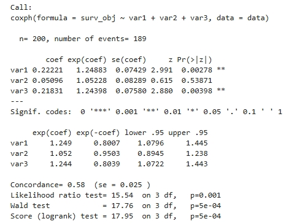
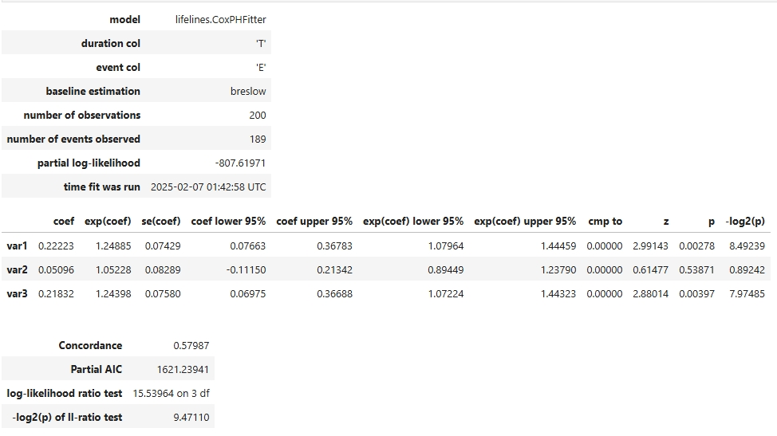
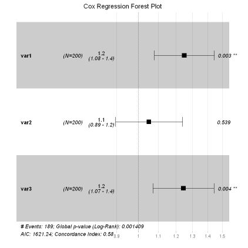
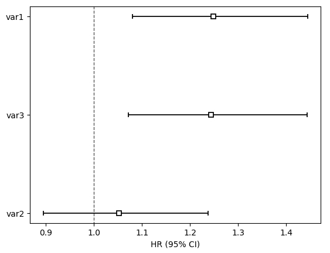

# Cox回归

Cox回归（Cox比例风险回归）是一种常用的生存分析模型，用于研究多个变量对事件发生风险的影响。它的核心是估计每个变量的风险比（Hazard Ratio），在控制其他变量的情况下，量化某一因素对生存时间或事件发生概率的影响。

在医疗建模中，Cox回归常被用于分析疾病进展或治疗效果，例如评估某种药物、基因或患者特征对生存时间的影响，为个性化治疗提供依据。

## R和Python核心包介绍

R包（R版本为4.4.2）：
- survival（3.8-3）：是 R 进行生存分析的核心包，由 Terry Therneau 维护，提供了构建 Cox 回归模型、Kaplan-Meier 估计、Log-rank 检验等功能。
- survminer（0.5.0）：survminer 是 survival 的可视化扩展包，提供了美观且直观的生存分析图表。

Python包（Python版本为3.11.5）：
- lifelines（0.30.0）： 是一个用于生存分析的 Python 库，在 Cox 回归中用于 拟合 Cox 比例风险模型（CoxPHFitter）、检查比例风险假设、计算生存函数，并提供可视化支持。

## R语言和Python效果对比

详细代码：[R代码](./R.ipynb) [Python代码](./Python.ipynb)

对比结果：

<table>
  <tr>
    <td style="text-align: center;">
      
      
R的回归结果

    </td>
    <td style="text-align: center;">
      
      
Python的回归结果

    </td>
  </tr>
  <tr>
    <td style="text-align: center;">
      
      
R森林图结果

    </td>
    <td style="text-align: center;">
      
      
Python森林图结果

    </td>
  </tr>
</table>
