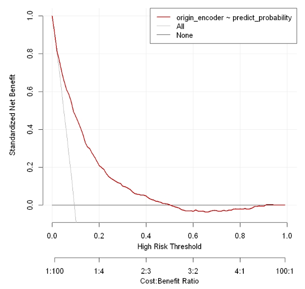
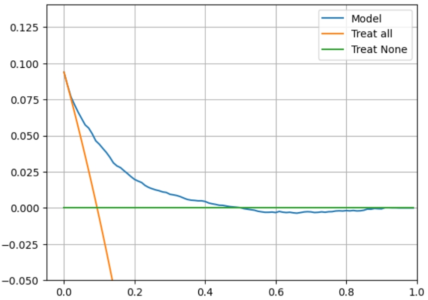
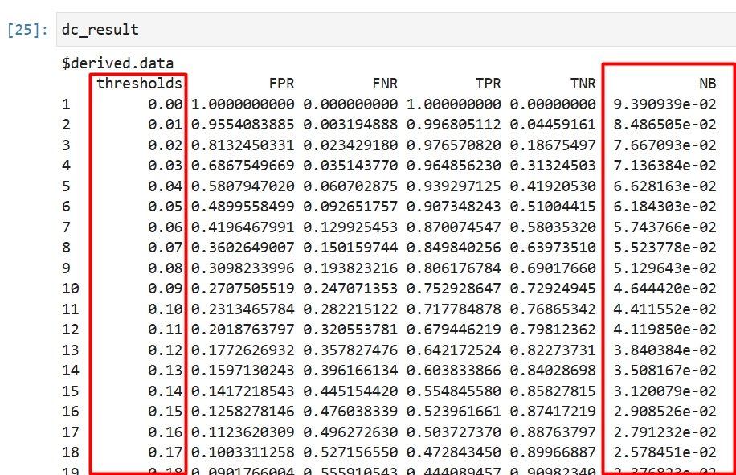
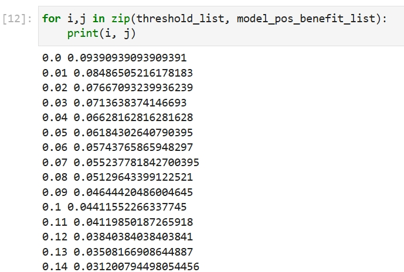

# DCA曲线

决策曲线分析（Decision Curve Analysis, DCA）是一种评估模型临床实用性的方法。它通过结合模型预测结果与患者可能接受的治疗干预范围，计算不同阈值下的净收益（Net Benefit）。

具体而言，在医疗建模中，DCA可以帮助判断预测模型是否能有效指导治疗决策，比如在筛查某种疾病时权衡漏诊风险与过度治疗的代价，最终为临床医生提供基于患者利益的辅助判断依据。

## R和Python相关包介绍

R包（R版本为4.4.2）：
- rmda（1.6）：RMDA（Risk Model Decision Analysis）在绘制DCA曲线时的作用是评估不同风险阈值下模型的净收益，通过比较模型预测的风险概率与实际临床决策的效益，为模型选择提供决策支持。

Python包（Python版本为3.11.5）：
- sklearn（1.5.2）： 负责计算绘制 DCA 曲线所需的关键指标，如混淆矩阵系数等。
- matplotlib（3.8.0）：用于将 sklearn 计算出的混淆矩阵和其他线条以折线图的形式可视化，生成直观的 DCA 曲线图。

## R语言和Python效果对比

详细代码：[R代码](./R.ipynb) [Python代码](./Python.ipynb)

对比结果：

<table>
  <tr>
    <td style="text-align: center;">
      
      
R结果

    </td>
    <td style="text-align: center;">
      
      
Python结果

    </td>
  </tr>
  <tr>
    <td style="text-align: center;">
      
      
R点位结果

    </td>
    <td style="text-align: center;">
      
      
Python点位结果

    </td>
  </tr>    
</table>
