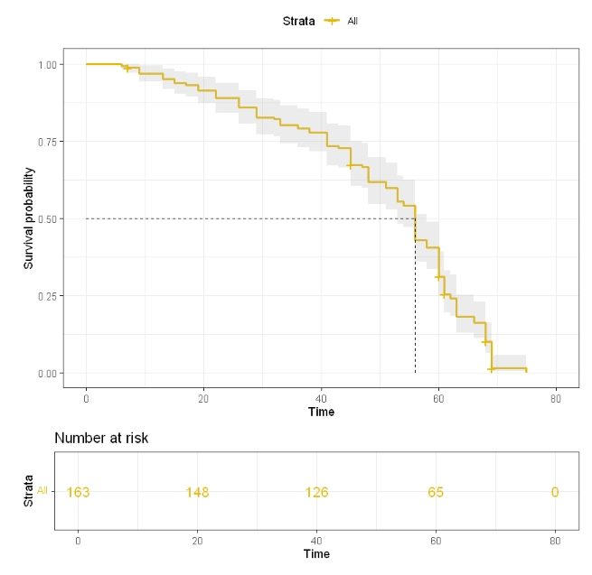
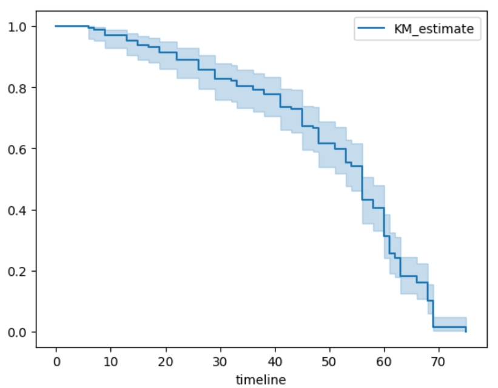

# Kaplan-Meier估计

Kaplan-Meier估计（KM估计）是一种用来分析生存数据的非参数统计方法，用于估计事件发生的生存概率随时间的变化。在医疗建模中，KM估计常用于分析患者在特定治疗或疾病状态下的生存率。

例如评估不同治疗方案对癌症患者生存时间的影响。通过绘制KM生存曲线，可以直观地比较不同组别的生存情况，帮助临床医生进行治疗决策。

## R和Python相关包介绍

R包：
- survival（3.8-3）：用于生存分析，包括创建生存对象 (Surv) 和拟合Kaplan-Meier生存曲线 (survfit)。
- survminer（0.5.0）：用于绘制生存曲线图 (ggsurvplot)，提供了丰富的图形定制选项。

Python包：
- lifelines（0.30.0）： 是一个用于生存分析的 Python 库，在 Kaplan-Meier (KM) 估计中的作用是提供简单易用的接口来拟合和可视化生存曲线，支持对时间事件数据的非参数生存分析。

## R语言和Python效果对比

详细代码：[R代码](./R.ipynb) [Python代码](./Python.ipynb)

对比结果：

    

        
        
R结果

    

    

        
        
Python结果

    

