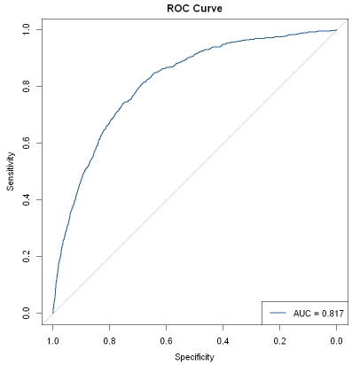
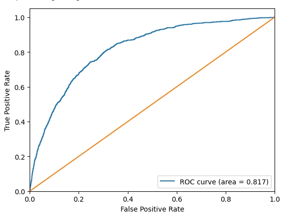

# ROC曲线

ROC曲线（Receiver Operating Characteristic Curve）通过不同预测阈值下的敏感性（True Positive Rate）和特异性的互补值（1-Specificity）来评估模型的分类性能。在医疗建模中，ROC曲线广泛用于评估疾病筛查或诊断模型的能力。

例如预测某种癌症的风险。曲线下面积（AUC）越大，表示模型对阳性和阴性样本的区分能力越强，从而帮助医生选择更可靠的预测模型。

## R和Python相关包介绍

R包（R版本为4.4.2）：
- pROC（3.8-3）：用于绘制和分析 ROC 曲线，支持 AUC 计算、置信区间估计、DeLong 检验等功能，常用于评估分类模型的性能。

Python包（Python版本为3.11.5）：
- sklearn（1.5.2）： 负责计算绘制 ROC 曲线所需的关键指标，包括假阳性率（FPR）、真阳性率（TPR）和 AUC（曲线下面积），并提供相应的工具函数。
- matplotlib（3.8.0）：用于将 sklearn 计算出的 FPR 和 TPR 以折线图的形式可视化，生成直观的 ROC 曲线图。

## R语言和Python效果对比

详细代码：[R代码](./R.ipynb) [Python代码](./Python.ipynb)

对比结果：

<table>
  <tr>
    <td style="text-align: center;">
      
      
R结果

    </td>
    <td style="text-align: center;">
      
      
Python结果

    </td>
  </tr>
</table>
