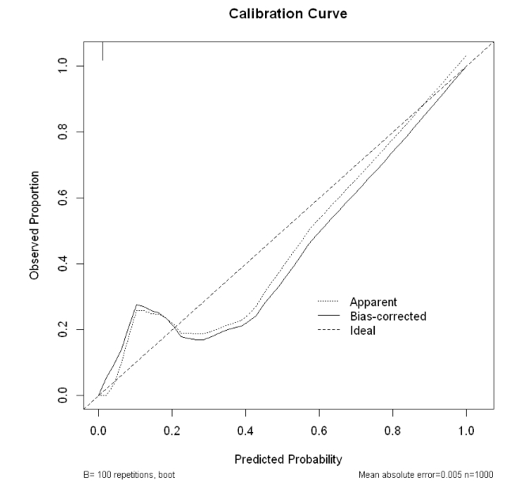
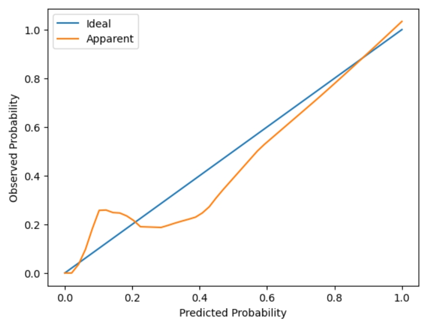
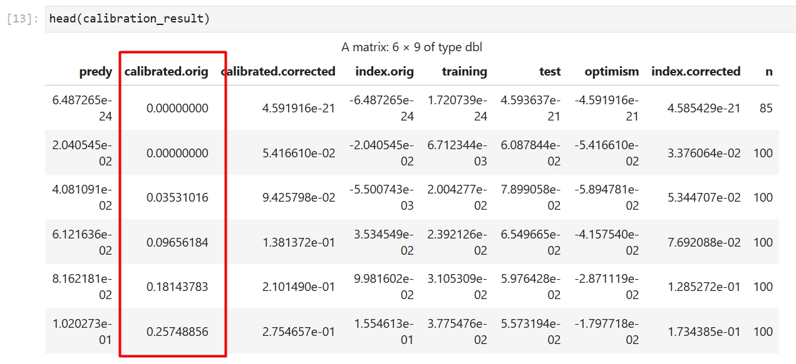
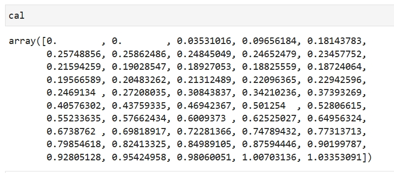

# 校准曲线

校准曲线（Calibration Curve）用于评估预测模型输出的概率与实际结果之间的一致性。在医疗建模中，它通过绘制模型预测概率与实际阳性率的关系，展示模型在不同概率区间的预测准确性。

例如，在疾病风险预测中，校准曲线可以帮助判断模型预测的风险是否与患者实际发病率相符，从而评估模型在临床中的可靠性。

## R和Python核心包介绍

R包（R版本为4.4.2）：
- rms（7.0-0）包内置校准曲线功能，可以基于构建的逻辑回归模型快速绘制校准曲线

Python包（Python版本为3.11.5）：
- statsmodels（0.14.4）：用于逻辑回归建模，以及lowess平滑函数
- matplotlib（3.8.0）：用于基于计算结果绘制校准曲线
- scipy（1.11.1）：用于对lowess函数平滑结果进行插值

## R语言和Python效果对比

详细代码：[R代码](./R.ipynb) [Python代码](./Python.ipynb)

对比结论：校准曲线的Apparent结果完全一致，如果需要复现另一条Corrected采样的结果，由于R语言和Python底层函数方法的不同，对于rms中采样的校准曲线复现难度较大，存在微弱差异无法对齐，正在持续进行中...

对比过程：

<table>
  <tr>
    <td style="text-align: center;">
      
      
R画图结果

    </td>
    <td style="text-align: center;">
      
      
Python画图结果

    </td>
  </tr>
  <tr>
    <td style="text-align: center;">
      
      
R关键点位

    </td>
    <td style="text-align: center;">
      
      
Python关键点位

    </td>
  </tr>
</table>
