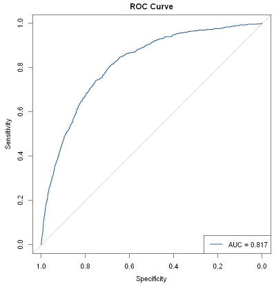
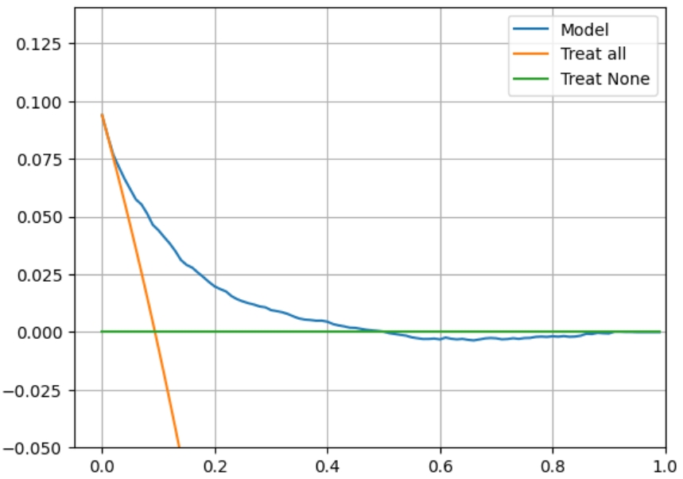

# 校准曲线

校准曲线（Calibration Curve）用于评估预测模型输出的概率与实际结果之间的一致性。在医疗建模中，它通过绘制模型预测概率与实际阳性率的关系，展示模型在不同概率区间的预测准确性。

例如，在疾病风险预测中，校准曲线可以帮助判断模型预测的风险是否与患者实际发病率相符，从而评估模型在临床中的可靠性。

## R和Python相关包介绍

R包（R版本为4.4.2）：

Python包（Python版本为3.11.5）：
- scikit-learn（1.5.2）：提供 calibration_curve 计算预测概率的分箱结果，以及 CalibratedClassifierCV 进行概率校准，使校准曲线更接近理想情况。
- matplotlib（3.8.0）：用于绘制校准曲线，通过可视化模型预测概率与真实概率的偏差，辅助评估模型的概率输出质量。

## R语言和Python效果对比

详细代码：[R代码](./R.ipynb) [Python代码](./Python.ipynb)

对比结果：

<table>
  <tr>
    <td style="text-align: center;">
      
      
R结果

    </td>
    <td style="text-align: center;">
      
      
Python结果

    </td>
  </tr>
</table>
