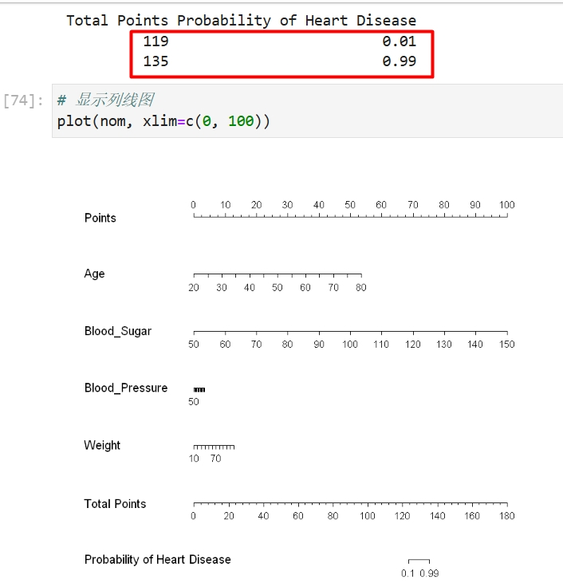
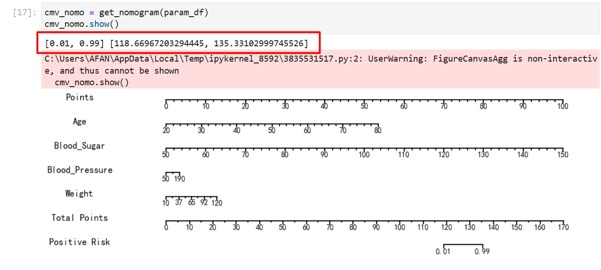

# ROC曲线

列线图（Nomogram）是一种基于线性回归、逻辑回归模型的直观工具，用于将统计学模型的预测结果转化为个体化的风险评估。

在医疗建模场景中，列线图通常用于预测患者某种疾病的发生概率或治疗后的预后。 通过将多个关键特征（如年龄、血压、肿瘤大小等）的回归系数标准化为点数，列线图将这些特征组合为一个总得分，并通过总分对应的标尺给出预测概率。这种方法便于临床医生直观地评估患者风险，辅助精准医疗决策。

## R和Python核心包介绍

R包（R版本为4.4.2）：
- rms（7.0-0）包内置列线图绘制功能，可以基于构建的逻辑回归模型快速绘制列线图

Python包（Python版本为3.11.5）：
- statsmodels（0.14.4）：用于逻辑回归建模
- matplotlib（3.8.0）：用于基于计算结果绘制列线图

## R语言和Python效果对比

详细代码：[R代码](./R.ipynb) [Python代码](./Python.ipynb)

对比结果：

<table>
  <tr>
    <td style="text-align: center;">
      
      
R结果

    </td>
    <td style="text-align: center;">
      
      
Python结果

    </td>
  </tr>
</table>

## 补充说明

可以看到，上面的Points、Total Points以及最下面的概率线段都和R几乎完全一致，并在概率点位上的数值也一样，而其他线段和R的实现的数值结果也是相同的，所以不影响大家的使用。

之所以显示效果不同在于，R的[nomogram函数的源码](https://github.com/harrelfe/rms/blob/master/R/nomogram.s)中生成刻度使用了[pretty函数](https://github.com/wch/r-source/blob/trunk/src/library/base/R/pretty.R)，这个函数的效果如[这个例子](https://www.rdocumentation.org/packages/base/versions/3.6.2/topics/pretty)所示，它能将刻度转成更好看的区间形式。我尝试过对这个pretty进行复现，但是由于其底层还调用了R的.Interval函数，而这个是R语言中用于调用底层C函数的接口，因此复现起来非常困难，Python目前也没有类似的pretty函数的三方库，所以这里我只是根据自己的理解实现了上面的`adj_range`函数。这是stackoverflow论坛对此的[讨论](https://stackoverflow.com/questions/43075617/python-function-equivalent-to-rs-pretty)