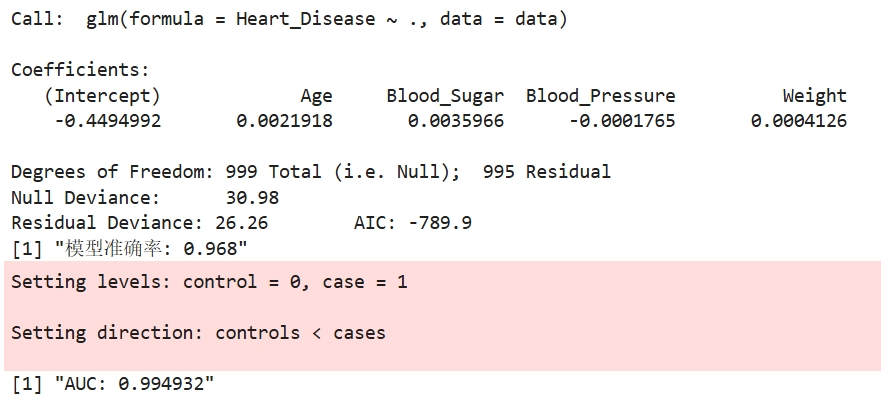
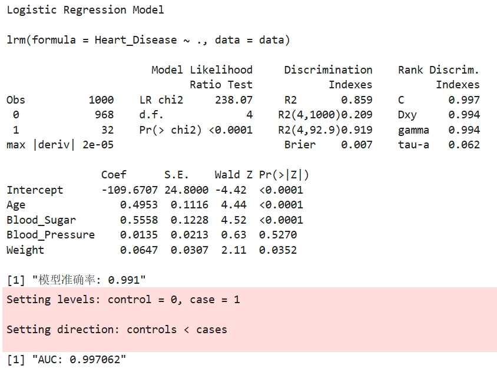
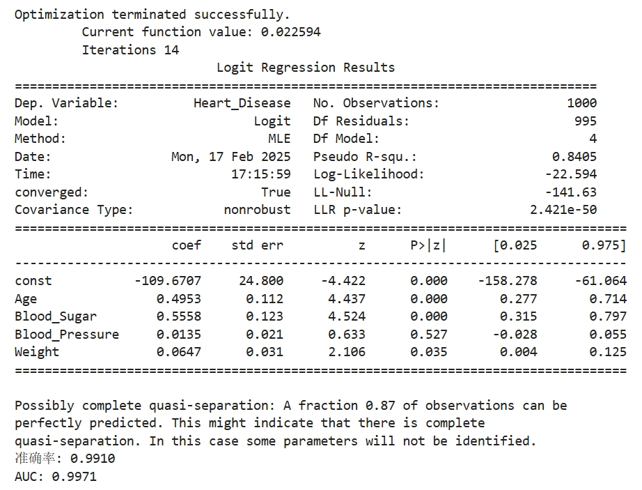
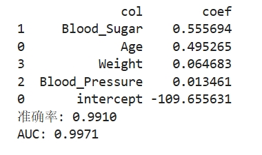

# 逻辑回归

逻辑回归（Logistic Regression）是一种用于分类任务的统计方法，广泛应用于医学数据分析中，尤其是在二分类问题中。它通过将输入特征映射到概率值，帮助预测某一事件发生的概率。在医学领域，逻辑回归常用于诊断疾病、预测患者的病程以及评估风险因素与疾病发生之间的关系。

例如，逻辑回归可用于分析某些生物标志物与疾病（如心脏病、糖尿病等）之间的关系，帮助医生预测患者是否患有某种疾病。通过建立逻辑回归模型，临床医生能够根据患者的年龄、性别、体重、血糖水平等特征，得出患病的概率，进而做出早期诊断和治疗决策。

## R和Python相关包介绍

R包（R版本为4.4.2）：
- rms（7.0-0）包在逻辑回归中用于提供更精确的模型拟合和诊断，帮助评估模型的表现和可靠性。

Python包（Python版本为3.11.5）：
- sklearn（1.5.2）：提供简单易用的逻辑回归实现，支持模型训练、预测和评估，适合机器学习任务。
- statsmodels（0.14.4）：提供详细的统计分析功能，适合用于逻辑回归的系数估计、显著性检验和模型诊断。

## R语言和Python效果对比

详细代码：[R代码](./R.ipynb) [Python代码](./Python.ipynb)

对比过程：我使用相同的数据对不同方法进行了逻辑回归建模，并对比了输出系数以及预测结果的准确率和AUC。通过对比，我发现R语言提供了glm和lrm两种方法来实现逻辑回归，而这两种方法在系数和预测结果上存在显著差异，且差异较大。Python则提供了statsmodels和sklearn两种实现，二者的结果非常接近，系数上仅存在小的精度差异，预测准确率也完全一致。具体而言，R语言中的lrm方法与Python中的statsmodels结果一致，而与sklearn的结果差异主要体现在statsmodels和sklearn之间的精度差异。相比之下，R的glm方法的效果最差。

通过下图可以更直观地比较各方法的实现结果。

对比结果： ① 不同于任何；② = ③；③和④几乎一致

<table>
  <tr>
    <td style="text-align: center;">
      
      
①R中glm实现结果

    </td>
    <td style="text-align: center;">
      
      
②R中lrm实现结果

    </td>
  </tr>
  <tr>
    <td style="text-align: center;">
      
      
③Python中statsmodels实现结果

    </td>
    <td style="text-align: center;">
      
      
④Python中sklearn实现结果

    </td>
  </tr>    
</table>
